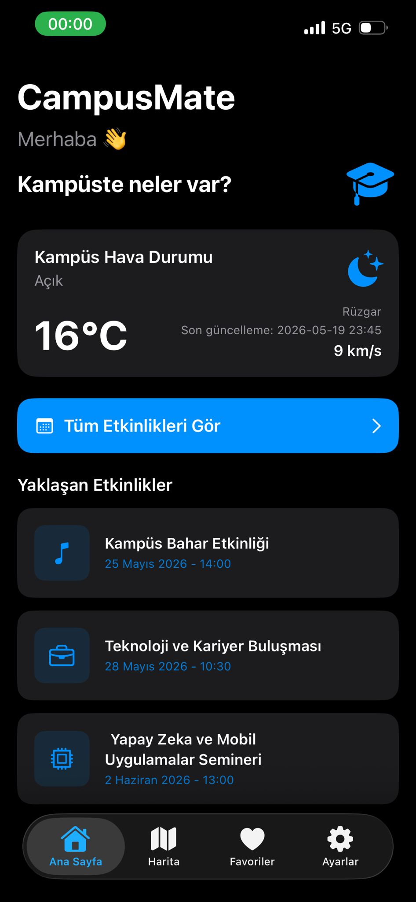
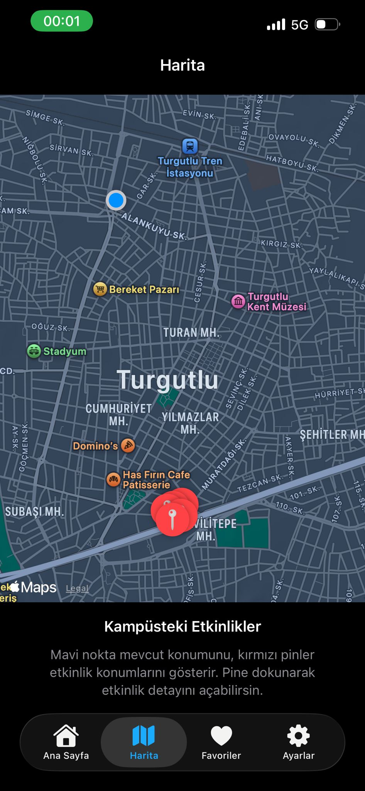
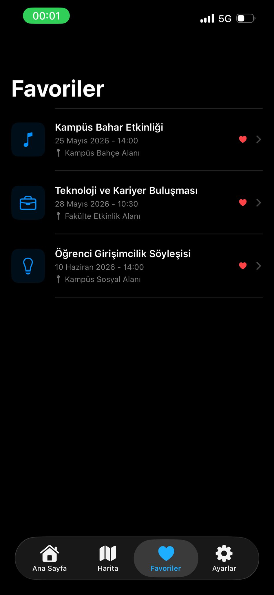
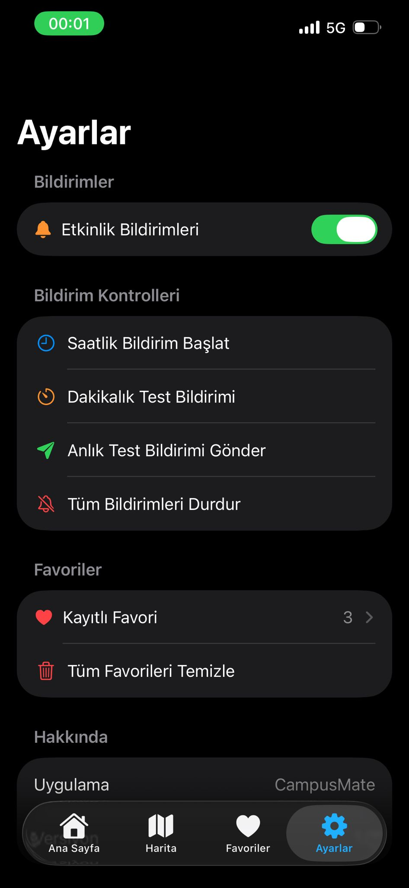
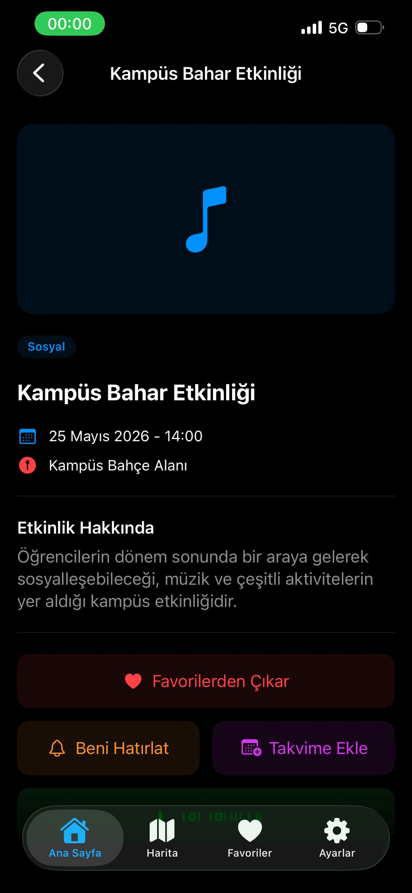
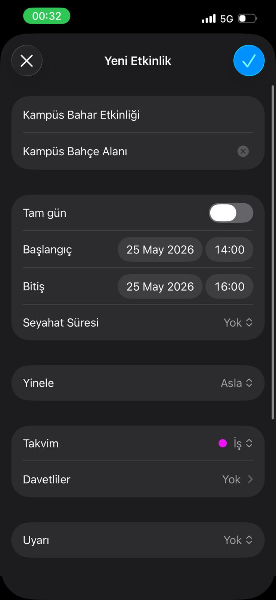
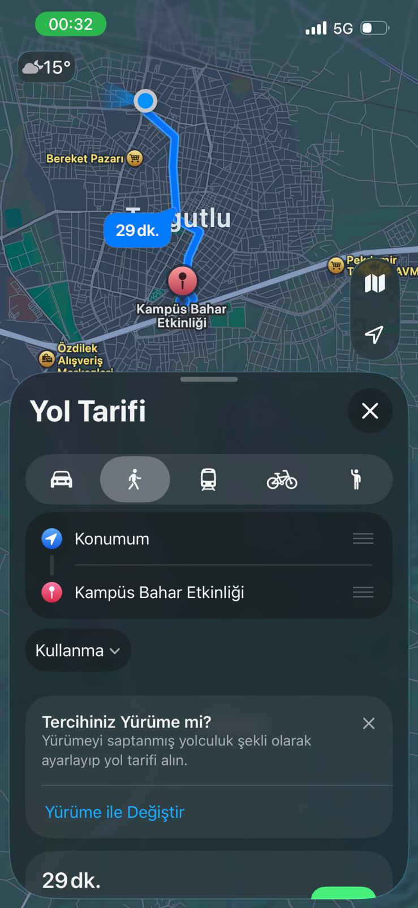

# 🎓 CampusMate

CampusMate, öğrencilerin kampüs etkinliklerini kolayca takip edebilmesi için geliştirilmiş bir iOS mobil uygulamasıdır.

Uygulama; etkinlik listeleme, favorilere ekleme, harita üzerinde etkinlik konumlarını gösterme, hava durumu verisi çekme, bildirim oluşturma, takvime ekleme ve Apple Maps ile yol tarifi alma özelliklerini içerir.

---

## 📱 Uygulama Özeti

CampusMate ile kullanıcılar:

- Kampüsteki yaklaşan etkinlikleri görüntüleyebilir.
- Etkinlik detaylarını inceleyebilir.
- Etkinlikleri favorilerine ekleyebilir.
- Favoriler cihazda kalıcı olarak saklanır.
- Güncel kampüs hava durumunu görüntüleyebilir.
- Etkinlik konumlarını harita üzerinde görebilir.
- Apple Maps ile etkinlik konumuna yol tarifi alabilir.
- Etkinliği cihaz takvimine ekleyebilir.
- Etkinlikler için bildirim hatırlatması oluşturabilir.
- Ayarlar ekranından bildirim ve favori kontrollerini yönetebilir.

---

## 🚀 Kullanılan Teknolojiler

- Swift
- SwiftUI
- MVVM mimarisi
- MapKit
- EventKit / EventKitUI
- UserNotifications
- URLSession
- UserDefaults
- WeatherAPI
- Git / GitHub

---

## 🖼️ Ekran Görüntüleri

### Splash Ekranı


---

### Ana Sayfa



---

### Harita



---

### Favoriler



---

### Ayarlar




---

### Etkinlik Detay



---

### Takvime Ekleme



---

### Apple Maps Yol Tarifi



---

## 🧩 Özellikler

### 🏠 Ana Sayfa

Ana sayfada kampüs hava durumu ve yaklaşan etkinlikler gösterilir. Kullanıcı buradan etkinliklere hızlıca erişebilir.

### 🌦️ Hava Durumu Servisi

WeatherAPI kullanılarak güncel hava durumu verisi alınır. Sıcaklık, hava durumu, rüzgar bilgisi ve son güncelleme zamanı ana sayfada gösterilir.

### 🗺️ Harita ve Konum

Kullanıcının mevcut konumu haritada mavi nokta olarak gösterilir. Etkinlikler harita üzerinde pin olarak listelenir.

### 📍 Yol Tarifi

Etkinlik detay ekranındaki “Yol Tarifi Al” butonu ile Apple Maps açılır ve kullanıcı seçilen etkinlik konumuna rota alabilir.

### ❤️ Favoriler

Kullanıcı etkinlikleri favorilerine ekleyebilir. Favoriler `UserDefaults` ile cihazda kalıcı olarak saklanır.

### 🔔 Bildirimler

Etkinlik detayından hatırlatma oluşturulabilir. Ayrıca ayarlar ekranında anlık ve dakikalık test bildirimleri yönetilebilir.

### 📅 Takvime Ekleme

Etkinlik detay ekranından seçilen etkinlik cihaz takvimine eklenebilir. Etkinlik adı, konumu, tarihi ve saati otomatik olarak takvim ekranına aktarılır.

---

## 📁 Proje Yapısı

```text
CampusMate
├── Models
│   ├── Event
│   └── Weather
│
├── Services
│   ├── WeatherService
│   └── NotificationService
│
├── ViewModels
│   ├── EventListViewModel
│   ├── EventDetailViewModel
│   ├── FavoritesViewModel
│   ├── MapViewModel
│   └── WeatherViewModel
│
├── Views
│   ├── HomeView
│   ├── EventListView
│   ├── EventDetailView
│   ├── FavoritesView
│   ├── MapView
│   ├── SettingsView
│   └── SplashView
